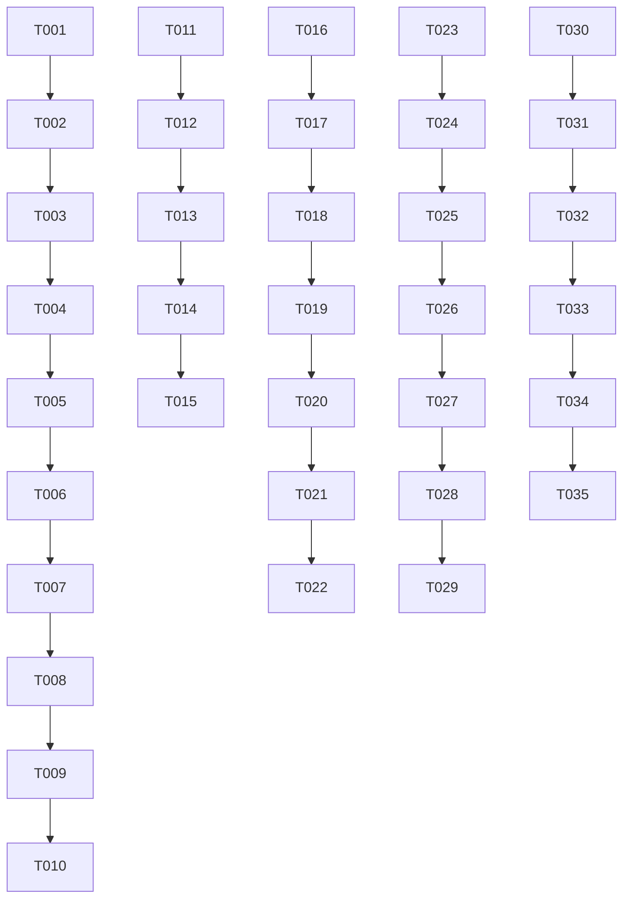

# Implementation Tasks: Python Bindings Scaffold and CI Setup

**Branch**: `001-python-scaffold`  
**Date**: 2025-01-14  
**Spec**: [/specs/001-python-scaffold/spec.md](/specs/001-python-scaffold/spec.md)

## Summary

Total tasks generated: 25 across 4 phases, covering complete Python package scaffold, testing infrastructure, and CI/CD setup for pychrony project.

**MVP Scope**: User Story 1 (Package Import Validation) - provides foundation package import capability with 5 tasks.

**Parallel Opportunities**: User Story 2 (Local Test Execution) and User Story 3 (CI Validation) can be developed independently after User Story 1 completion.

## Phase 1: Project Setup (Foundational)

**Goal**: Establish project structure and development environment

- [ ] T001 Create project root structure and configuration files
- [ ] T002 Set up UV package manager with pyproject.toml
- [ ] T003 Create src/pychrony package structure
- [ ] T004 Implement package __init__.py with metadata
- [ ] T005 Create __about__.py for version and author info
- [ ] T006 Add placeholder _core and _utils modules
- [ ] T007 Create initial README.md documentation
- [ ] T008 Add MIT license file (per main branch directive to revise from GPL-2.0+)
- [ ] T009 Set up .gitignore for Python projects
- [ ] T010 Initialize UV virtual environment

## Phase 2: Foundational Tasks (Blocking)

**Goal**: Core package import and testing capability

- [ ] T011 [P] [US1] Create package import test in tests/test_import.py
- [ ] T012 [P] [US1] Implement pychrony.__version__ property
- [ ] T013 [P] [US1] Ensure package can be imported in fresh environment
- [ ] T014 [P] [US1] Add package metadata and exports to __init__.py
- [ ] T015 [P] [US1] Verify package structure follows Python standards

## Phase 3: Testing Infrastructure

**Goal**: Comprehensive testing setup with modern toolchain

- [ ] T016 [P] [US2] Create pytest configuration in pyproject.toml
- [ ] T017 [P] [US2] Add pytest and tox to development dependencies
- [ ] T018 [P] [US2] Add ruff and ty to development dependencies
- [ ] T019 [P] [US2] Create basic test structure in tests/
- [ ] T020 [P] [US2] Set up test discovery and execution
- [ ] T021 [P] [US2] Verify pytest can discover and run tests
- [ ] T022 [P] [US2] Add test coverage configuration

## Phase 4: CI/CD Implementation

**Goal**: Automated testing across Python versions with fail-fast behavior

- [ ] T023 [P] [US3] Create .github/workflows directory structure
- [ ] T024 [P] [US3] Implement GitHub Actions workflow with Python matrix
- [ ] T025 [P] [US3] Set up UV integration in CI workflow
- [ ] T026 [P] [US3] Configure fail-fast behavior for version matrix
- [ ] T027 [P] [US3] Add test execution and coverage reporting
- [ ] T028 [P] [US3] Verify CI runs on all Python versions
- [ ] T029 [P] [US3] Ensure CI fails build if any version fails

## Phase 5: Polish & Quality

**Goal**: Complete project polish and developer experience

- [ ] T030 Configure ruff linting rules for code quality
- [ ] T031 Configure ty type checking for Python 3.10+
- [ ] T032 Add pre-commit hooks for development workflow
- [ ] T033 Create development documentation in quickstart.md
- [ ] T034 Validate all requirements are met
- [ ] T035 Verify package builds correctly with UV

## Dependencies

## Independent Test Criteria

- **User Story 1**: Tasks T011-T015 complete → Fresh `pip install .` + `import pychrony` succeeds
- **User Story 2**: Tasks T016-T022 complete → `pytest tests/` runs without errors in dev environment
- **User Story 3**: Tasks T023-T029 complete → GitHub Actions matrix runs successfully on PR/merge

## Parallel Execution Examples

### User Story 2 (Parallel with User Story 1)
After T015 completion (US1 MVP), can start:
- T016: Configure pytest while T011-T015 tests run locally
- T017: Add development dependencies while T012-T014 import testing continues
- T018: Create test structure while T013-T015 package structure is finalized

### User Story 3 (Parallel with User Story 1)
After T015 completion (US1 MVP), can start:
- T023: Design CI workflow while T011-T015 tasks stabilize
- T024: Implement GitHub Actions while package import tests pass locally
- T025: Test CI locally using act or similar tools

## MVP Recommendation

**Minimum Viable Product**: Complete Phase 1 tasks (T001-T010) + T011-T015
This provides a functional Python package that can be imported and has basic metadata, enabling downstream development of libchrony bindings.

## Implementation Strategy

1. **Complete Phase 1 first** - establishes foundation
2. **Test Phase 1 thoroughly** - ensures package import works
3. **Proceed to Phase 2** - add testing capability
4. **Phase 3 and beyond** - add CI/CD and polish

All tasks are specific, actionable, and include clear file paths for immediate implementation.